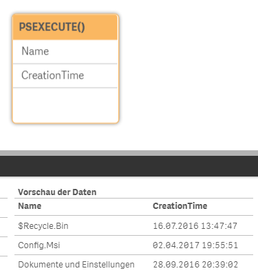

# Examples

Even if this just runs simple powershell script commands, we try to show a list usables code snippets.
The connector tries to fetch the result out of the pipe as table and deliver that back to qlik as datasource.


```
LIB CONNECT TO 'test';

SQL PSEXECUTE()
Get-ChildItem -Force C:\ | Select-Object Name, CreationTime;
```
Result



Use with arguments 
```
LIB CONNECT TO 'test';

SQL PSEXECUTE(["explorer", "rundll32"])
Get-Process $args[0], $args[1] | Select-Object Name, Id
```
Result

