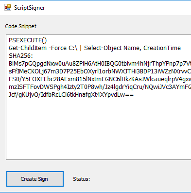

# Signature

If you don't define a user under which the powershell is executed, you have
the possibility to run the script in the context of the qlik service.
To ensure that this is not a secruity lack, the script code has to be
digital signed with the qlik root certifictate.

If you don't like to to this with commond commandline tools you can just
start the QlikConnectorPSExecute.exe on the server. This will open the
following screen and will automatically sign your script code.

You can now copy that into your script and everybody can execute that
signed script, so please be aware what your are sign.
